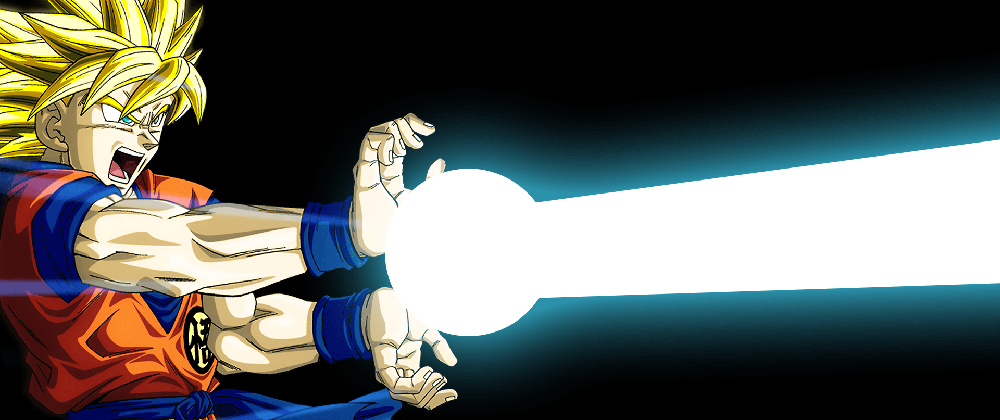

# To-do List Goku's Kamehameha

## Project Name
This is the final guide to learn Goku's Kamehameha

## Installation
Online

## Usage
Free to use

## Contributing
Fork it!
Create your feature branch: git checkout -b my-new-feature
Commit your changes: git commit -am 'Add some feature'
Push to the branch: git push origin my-new-feature
Submit a pull request :D

## Credits
Carlos Cano

## License
MIT License